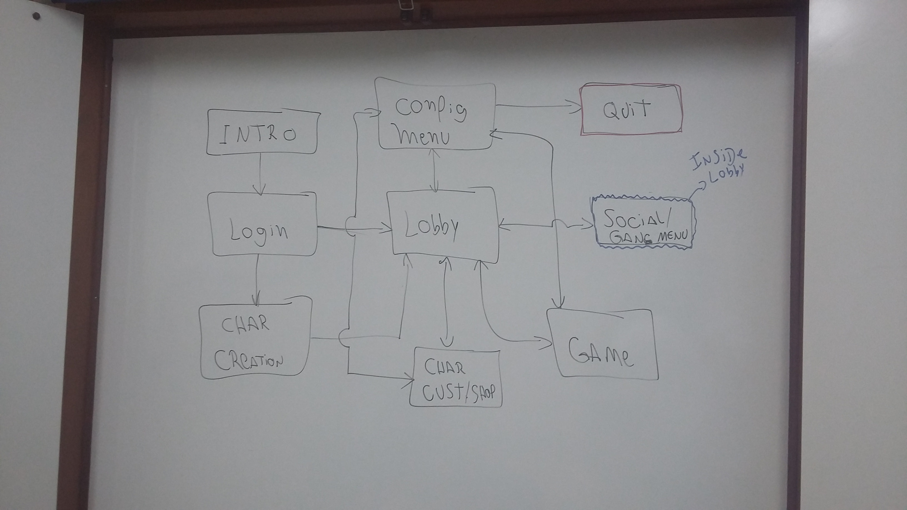

# Gameplay and Mechanics

## Gameplay

### Game Progression

There is two types of progression in the game, one is the 
competitive: the ranking, and the another one is the casual/individual: the level and achievements. 
We will describe this two types below and how the'll affect the gameplay.

#### Ranking
        Worms's task

#### Level & Achievements
##### Level
As many other games level is the basic casual and individual progression.
As you play you gain *experience* and also *level*. As you reach new level
you unlock new items, basically *rollers* and also *weapons*.   
    
This table describe the level and weapons that players can unlock     

| Level  | Weapon  | Roller |
|---|---|---|
| 1  | metal  | is the law  |

##### Achievements

Achievements are self compensations for things that you do on your own.

List of achievements    

|Achievements|
|---|
| Kill 10 people |

### Objectives and Matches.
On Sycko City Early Access the main objective of the player is just
win the matches and advance his level/rank.   
There are two kind of games (*casual* and *ranked*) and two kind of 
matches(*TDM** and *DM**). Those who begin to play the game start playing in
*casual* modes because it's just fun and not so much competitive/serious. As you become more
skilled in the game and also powerful you will start to want more serious games 
with players skilled as you, and for you we offer the *ranked* mode.

### Play Flow
As the gamer begin Sycko City, his first duty is create his own character,
after that he joins the Lobby where he can choose whatever he want to do inside the Sycko
City possibilities: join game matches, learn practicing, customize his character,
buy items (both cosmetic and functional) and also many other things.

## Mechanics

Sycko City mechanics is simple and objective.

### Physics
The game physics is a reproduction of the newtonian on a 3D space, but with more joy.  
The player movement uses the joystick X,Y Axis or the keyboard arrows to move, 
it's a accelerated and inertial movement.    

            We are also studying a possible acceleration and deacceleration button to player's movement.
            
### Interactive Objects
Every object that have a minimal physics applied and that is inside game matches is considered interactive. The main and
fundamental type of objects are the weapons, almost every interactive object is a weapon, like a trash can or a metal bar.
That's also one of the reasons why we call Sycko City a beat 'em up game.    
    
There is also another kind of interactive object that you can get outside of game matches and it's
called Items. There are basically two kind of interactive items: Weapons and Rollers

#### Interactive Objects Table - Get only inside matches
| Interactive Object | Functionatily |              
| --- | --- |                                       
| Whey Bar | +10% of Health|                        

#### Interactive Weapons Table - Get only inside matches
| Weapons Name | Min Damage | Max Damage | Durability | Attack Speed |
|---| --- | --- | --- | --- |
|Bottle| 2 | 6 | 3 | 0.3s |

#### Weapon Items Table - Must be equipped outside matches
| Weapons Name | Min Damage | Max Damage | Durability | Attack Speed |      
|---| --- | --- | --- | --- |                                               
|Catuaba's Bottle| 3 | 9 | 6 | 0.3s |
                                                 
#### Rollers Items Table - Must be equipped outside matches
| Roller Name | Passive Effect |
| --- | --- |
| 10Ben Inliner | +10% of speed | 

* PS: inside matches you must pickup or drop your weapons through the specified pickup button.

### Action and Combat

Sycko City is a multilayer fight game where players fight against each other with
cold weapons and rollers on foot, and to attack, players must hold and release the attack buttons to have a more effective attack. 
Hold and Release speed changes with the character equipped weapon/roller.

### Buttons
| Button        | Keyboard | Joystick |
|     ---       | ---      | ---      |
| Attack L      |   A      |    X     |
| Attack R      |     S    |     A    |
| Defense       |     X    |    L1    |
| Movement      |Directional| L-Axis  |

### Economy

The game mechanics economy is basically the money and the progression as explained above. The money of the game
is the quantity of water that a character have, let's say that it's the exchange coin. As player progress in game he unlocks
more items and then he can spend his water on it. He also can buy cosmetic items with real life money.

### Screen Flow

## Game Option
Game option is divided in sections, below is each one of them.

### Graphic Section
On Graphic Section you can adjust your brightness and your graphic quality. You
can toggle from fullscreen to windowed and also change the screen size.

### Gameplay Section
On gameplay section you can toggle from On/Off some elements of the HUD, 
like the health floating bar or the character name.

### Sound Section
In the sound section you can adjust the SFX and Music level, and toggle them from on to off.

    

